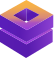

## About Noé Capital

Noé Capital is a forward-thinking investment firm specializing in private equity and real estate. With a strategic focus on high-potential businesses and value-driven investments, we partner with entrepreneurs, industry leaders, and investors to drive sustainable growth and long-term success.

## Developed by www.cyroX.org

The Laravel framework is open-sourced software licensed under the [MIT license](https://opensource.org/licenses/MIT).
composer install
composer update
docker compose down --volumes
docker compose build --no-cache
docker compose up -d
npm install 
npm run dev

## Nova 

php artisan migrate:fresh
